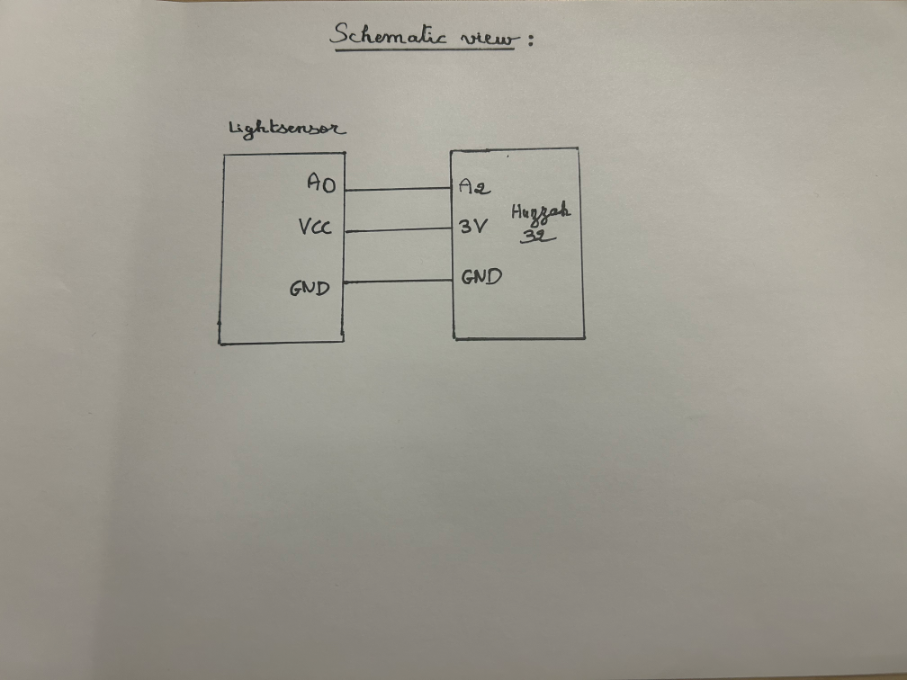

# MITID Assignment

An example of a final submission for the Designing with Web (DWW) and Connected Worlds & IoT (CWIOT) courses.
**The link to your repository must be submitted on Brightspace, under the Designing with Web course only!**

## What should be included in your repository

### For CWIOT

1.The complete code for your project, organized within a dedicated folder named cwiot.

#include "config.h"

AdafruitIO_Feed *Light = io.feed("light");
int luminosite;

void setup() {

  // start the serial connection
  Serial.begin(115200);

  // wait for serial monitor to open
  while(! Serial);

  Serial.print("Connecting to Adafruit IO");

  // connect to io.adafruit.com
  io.connect();

  // wait for a connection
  while(io.status() < AIO_CONNECTED) {
    Serial.print(".");
    delay(500);
  }

  // we are connected
  Serial.println();
  Serial.println(io.statusText());

}

void loop() {
  io.run();

  luminosite = analogRead(A2);

  Serial.print("sending -> ");
  Serial.println(luminosite);
  Light->save(luminosite);

  delay(3000);

}

#### Photographs
Youtube video of the prototype lerping between colors

### DWW

#### User flow 
[See the user flow in figma↗](https://www.figma.com/design/Qx5aoDR9QXJzO89CuRVzyk/Aziz_Prototype?node-id=25-6&t=vm0PFSbOJbOPvqBR-1)

